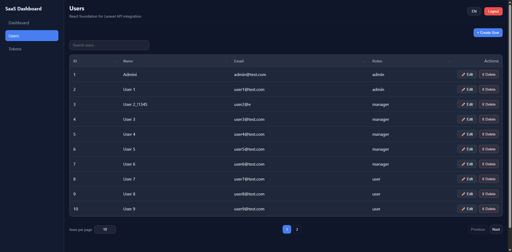
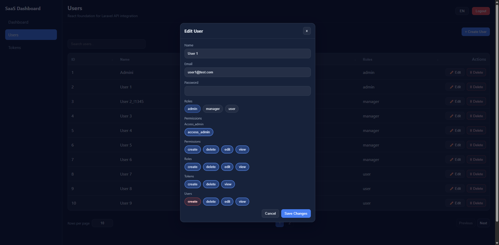
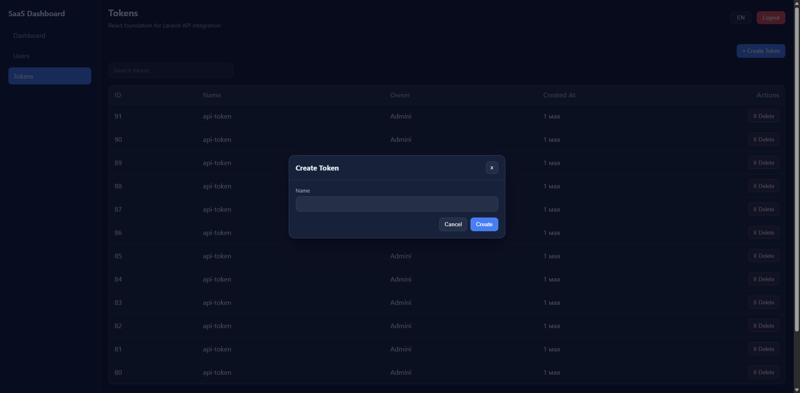
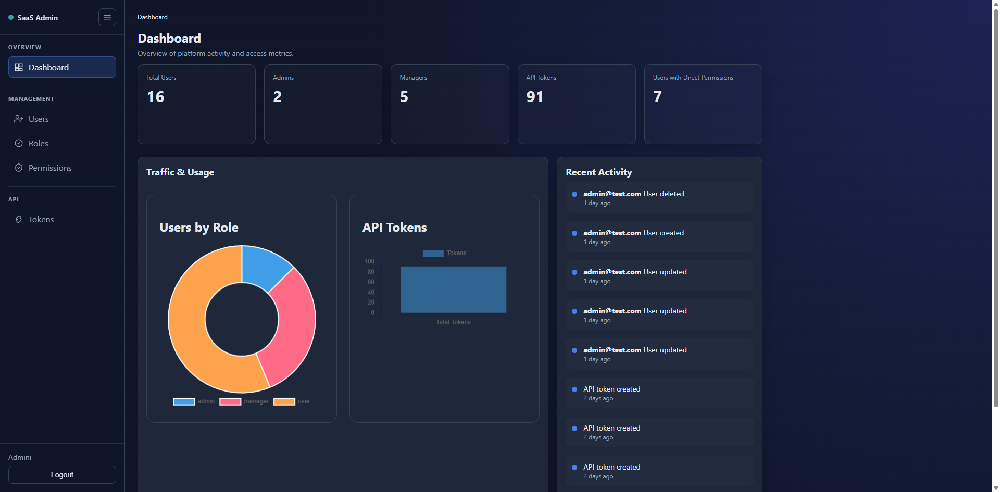
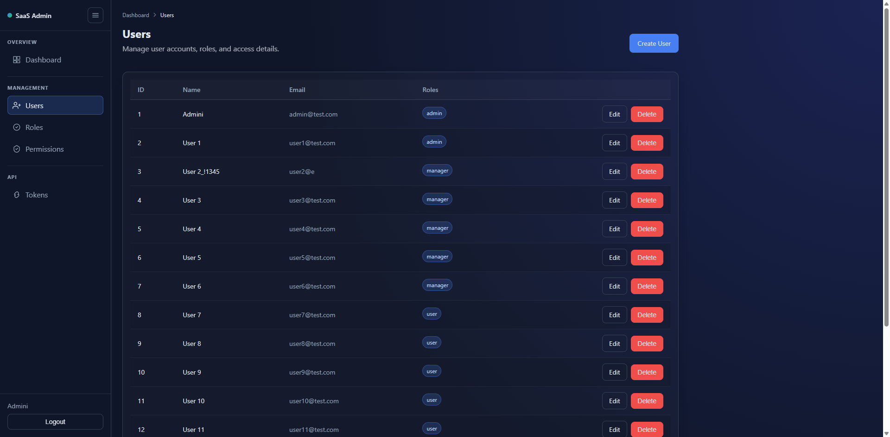
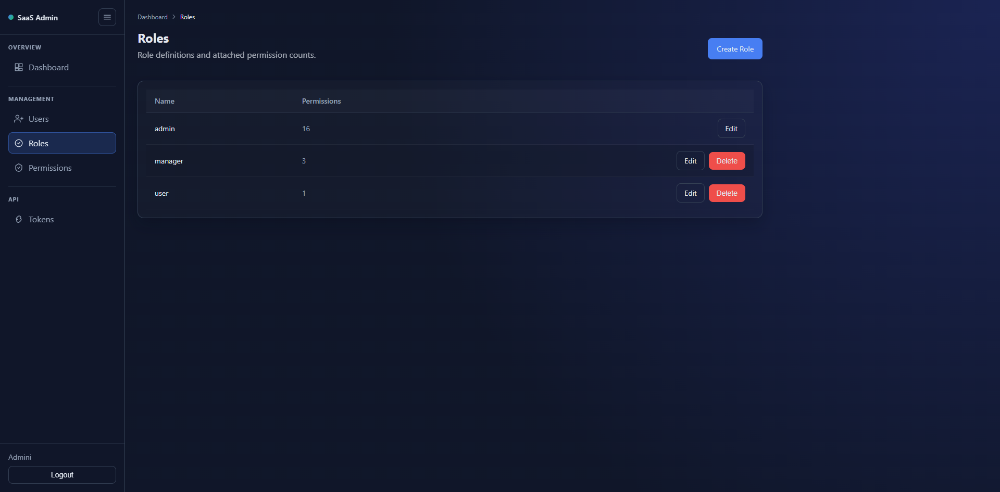
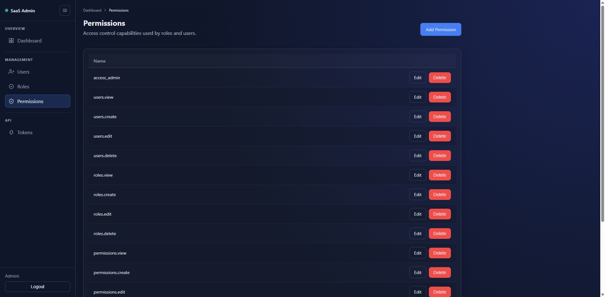

# Laravel + React SaaS Dashboard

Українська документація. Англійська версія: [README.md](./README.md)

## Огляд

Цей проєкт симулює реальну SaaS-архітектуру, де Laravel API обслуговує окремий React SPA фронтенд.

Його мета — показати engineering-рішення рівня production, а не базовий CRUD:
- API-first backend із чіткими контрактами
- RBAC-контроль доступу та permission-aware UI
- централізоване логування активностей для аудиту
- модульна frontend-архітектура з перевикористовуваними UI-системами

Проєкт демонструє, як backend і frontend масштабуються разом у monorepo.

## Чому саме цей стек

### Laravel (Backend)
Laravel обрано за баланс швидкої розробки та структурованої архітектури. У цьому проєкті він дає чіткий поділ на контролери, сервіси та моделі, сильну валідацію й передбачувані конвенції для API і Blade-адмінки.
Компроміс: Laravel важчий за мікрофреймворки, але екосистема та швидкість розробки краще підходять для SaaS-кодової бази.

### React (Frontend)
React забезпечує decoupled SPA, що чисто працює з Laravel API. Перевикористовувані UI-примітиви (таблиці, модалки, форми) дозволяють розвивати адмінку послідовно та масштабовано.
Компроміс: SPA має вищу складність, ніж server-rendered підхід, зате дає кращий UX і незалежність фронтенда.

### RBAC System
Модель доступу поєднує ролі, прямі дозволи та явні заборони (denied permissions). Це покриває і стандартні профілі доступу, і точкові винятки без хардкоду на кожній сторінці.
Компроміс: більше логіки в підтримці, але значно краща гнучкість для реальних admin-сценаріїв.

### Redis + Queues
Черги на Redis виносять не-критичні задачі (наприклад, activity logging) із request-response циклу, зберігаючи стабільну затримку API і готуючи систему до асинхронного масштабування.
Компроміс: додає операційні компоненти, але покращує чутливість системи та масштабованість.

### Docker
Docker дає відтворюване середовище для backend, frontend, БД і черг. Це зменшує «works on my machine» проблеми і пришвидшує онбординг.
Компроміс: невеликий локальний overhead, але значно краща передбачуваність у dev/CI.

### MySQL
MySQL відповідає реляційній доменній моделі цього проєкту: користувачі, ролі, дозволи, denied-зв’язки, токени, аудиторні логи.
Компроміс: менша гнучкість порівняно зі schema-light сховищами, але краща консистентність для RBAC і транзакцій.

### Sanctum (Auth)
Sanctum дає легку token-based автентифікацію для first-party SPA + API та природно інтегрується з middleware Laravel.
Компроміс: для складних third-party OAuth сценаріїв потрібні інші рішення, але для цього проєкту Sanctum оптимальний.

## Функціональність

### Backend
- API-first архітектура (Laravel)
- RBAC з ролями і дозволами
- Система логування активностей (service + observers)
- Валідація FormRequest для API
- Service layer для розділення бізнес-логіки
- Token-auth через Sanctum

### Frontend
- React SPA на Vite
- Захищений і permission-aware рендеринг UI
- Глобальний loader для async-операцій
- Модальні форми з обробкою 422 помилок валідації
- Перевикористовуваний DataTable (пошук, сортування, пагінація, дії)
- i18n підтримка (EN / UK / DE)

## Архітектура

### Потік запиту
`Controller -> Service -> Model -> JSON response`

- Контролери тримають тільки HTTP-рівень.
- Сервіси містять бізнес-логіку та правила змін.
- Моделі відповідають за збереження і зв’язки.
- FormRequest фіксує вхідні контракти.

### Розділення відповідальностей
- Backend API-first і придатний для різних клієнтів.
- Frontend споживає API через окремі service-модулі.
- RBAC забезпечується на двох рівнях:
  - backend middleware/authorization (джерело істини)
  - frontend conditional rendering (UX-рівень)

### Логування активностей
- Централізований `ActivityService` — точка входу в логування.
- Model observers автоматизують логування ключових подій.
- Dashboard-статистика може споживати recent activity.

### Використання DTO
- DTO-подібне формування відповіді зберігає передбачуваний контракт API для UI.

## Стек

### Backend
- PHP 8.3+
- Laravel 13
- Laravel Sanctum

### Frontend
- React (Vite)
- SCSS
- i18next

### Інфраструктура
- Docker Compose
- Nginx
- MySQL 8
- Redis 7

## Безпека

- Token-based автентифікація через Sanctum
- Хешування паролів через стандартний Laravel hashing layer
- Validation-first стратегія API через FormRequests
- RBAC enforcement через permission middleware
- Frontend ховає заборонені дії, але backend завжди перевіряє авторизацію
- Захист логіну побудований навколо API-валідації та централізованих auth endpoint-ів

## Розробка

### Розробка Frontend
- Код: `frontend/`
- Точка входу: `frontend/src/main.jsx`
- API-шар: `frontend/src/services/`
- i18n файли: `frontend/src/i18n/locales/`

### Розробка Backend
- Код: `backend/`
- API-роути: `backend/routes/api.php`
- Сервіси: `backend/app/Services/`
- Запити: `backend/app/Http/Requests/`

### Конфігурація
- Root `.env` використовується Docker-сервісами
- Приклад backend env: `backend/.env.example`
- Базовий URL API для frontend: `VITE_API_BASE_URL` (у frontend env)

## Запуск проєкту

1. Клонувати репозиторій
```bash
git clone <repository_url>
cd laravel-react
```

2. Створити файл середовища в корені
```bash
cp .env.example .env
```

3. Підняти Docker-сервіси
```bash
docker compose up -d
```

4. Відкрити сервіси
- Frontend: `http://localhost:5173`
- Backend (Nginx): `http://localhost:8080`
- Приклад API: `http://localhost:8080/api/users`

## Нотатки по середовищу

Docker-сервіси з `docker-compose.yml`:
- `backend` (php-fpm)
- `nginx`
- `frontend` (Vite dev server)
- `mysql`
- `redis`
- `websocket` (резерв для realtime/dev задач)

Важливо:
- Хост БД всередині контейнерів має відповідати Docker-сервісу (`mysql`).
- Порти керуються через `.env` (`APP_PORT`, `FRONT_PORT`).
- Backend і frontend підключені як volumes для live-розробки.

## Тестування

Feature-тести покривають критичні backend-флоу (включно з users API, metadata, activity logging, auth-related API checks).

Запуск тестів у backend контейнері:
```bash
docker compose exec -T backend php artisan test
```

Або локально (якщо встановлено PHP):
```bash
cd backend
php artisan test
```

## Скріншоти

### Frontend (React SPA)

#### Панель керування


#### Користувачі


#### RBAC (редагування користувача)


#### Токени


#### Створення токена


---

### Backend (Адмін-панель Blade)

#### Панель керування


#### Користувачі


#### RBAC


#### Ролі


#### Дозволи


#### Токени


## Структура проєкту

```text
/backend      Laravel API + backend-логіка адмінки
/frontend     React SPA
/docker       Dockerfiles і nginx-конфігурація
/docs         Додаткова документація
TODO.md       Покроковий план розробки
README.md     Англійська документація
README_UA.md  Українська документація
```

## Документація

- План розробки: [TODO.md](./TODO.md)
- Нотатки по архітектурі: [docs/architecture.md](./docs/architecture.md)
- Довідник команд: [docs/commands.md](./docs/commands.md)

## Підхід до розробки

- Feature-based commits
- Невеликі, тестовані кроки з `TODO.md`
- Чисті commit messages із чітким scope

Приклади commit-стилю:
- `feat(users): add roles and permissions sync in API`
- `fix(frontend): handle users fetch retry and empty states`

## Подальші покращення

- Додати повну API-документацію (OpenAPI/Swagger)
- Розширити end-to-end тестове покриття SPA-флоу
- Додати фільтрацію/експорт audit-логів
- Додати CI quality gates (lint + tests + build)
- Завершити production deployment docs

## Реліз

Поточний стабільний реліз: **v1.0.0**

Це перша portfolio-ready версія проєкту.

Репозиторій: [Laravel React SaaS](https://github.com/anatoliWeb/laravel-react-saas)

Основне в релізі:

- API-first backend на Laravel
- React SPA frontend
- Docker-оточення
- Токенна авторизація через Sanctum
- RBAC система з ролями, дозволами та забороненими дозволами
- Асинхронне логування активності через Redis queue та Supervisor
- Blade адмін-панель
- Повна документація проєкту

## Ліцензія

MIT License. Деталі у [LICENSE](./LICENSE).
